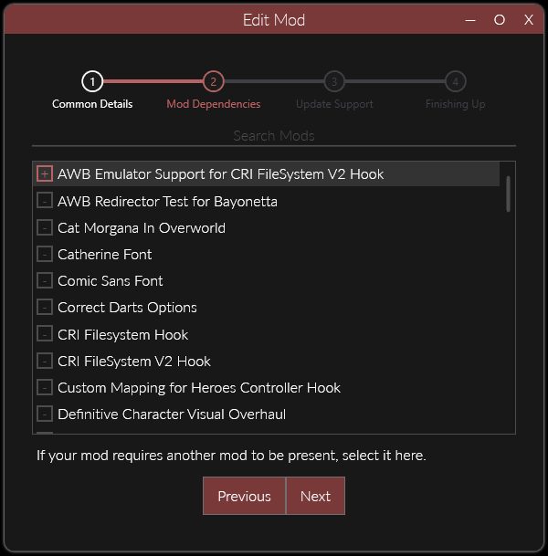

# About

!!! info

    CriFsHook has an extension mod that allows you to replace music inside AWB Containers. 

# Prerequisites

## Set Dependency on AWB Extension

In the `Edit Mod` menu (right click your mod in mods list) we're going to add `AWB Emulator Support for CRI FileSystem V2 Hook` as a dependency.  

# Usage

[Please refer to FileEmulationFramework wiki](https://sewer56.dev/FileEmulationFramework/emulators/awb.html).  

!!! note

    You can skip adding dependency on AWB emulator, do follow rest of guide though.

## Example

As per usage guide above.

!!! tip

    If game uses encryption on audio, you might need to encrypt your music with same keys in some cases.

## Limitations

!!! warning

    If the game uses an `.acb` file alongside the AWB, this mod assumes that the `.acb` will be named the same as the AWB, i.e. `BGM.acb` is used with `BGM.awb`.  

    If this is not the case, consider contributing to the project with an additional API 😇.